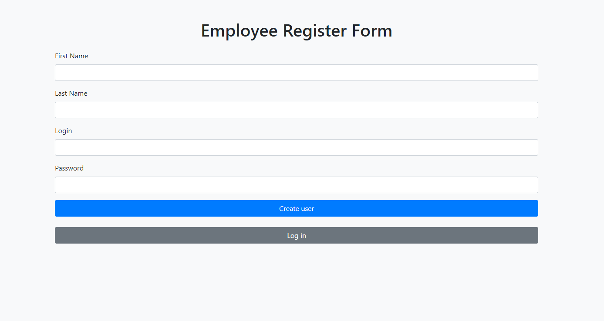
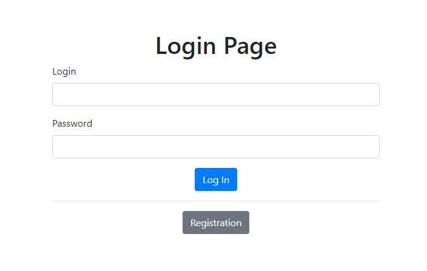
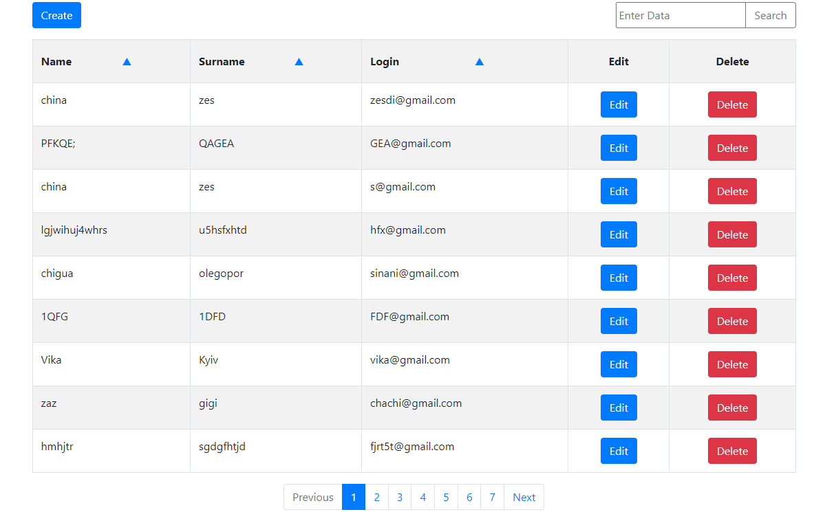
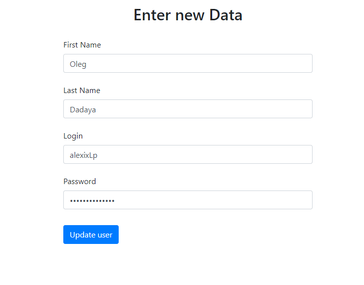
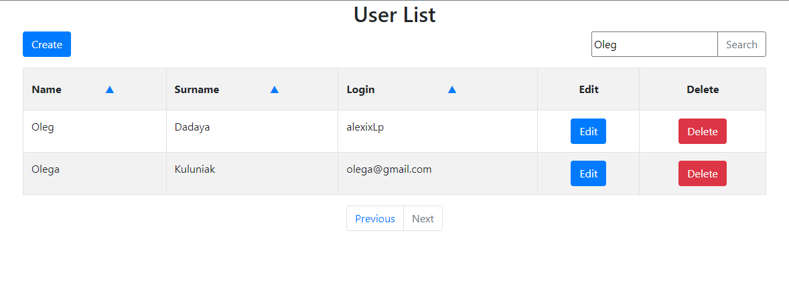

# User List Project

A Java-based web app for managing users. Add, update, delete, and search users.

## Getting Started

1. Clone the repository.
2. Install dependencies.
3. Configure PostgreSQL connection.
4. Launch on a web server.
5. Open browser to `http://localhost:8080`.

## Features

- Add, update, delete users.
- Search users.
- Responsive interface.

## PostgreSQL Configuration

Before you start, make sure to configure your PostgreSQL database:

1. Create this table in your database

```sql
CREATE TABLE users
(
    id         SERIAL PRIMARY KEY,
    first_name VARCHAR(50)  NOT NULL,
    last_name  VARCHAR(50)  NOT NULL,
    login      VARCHAR(50)  NOT NULL,
    password   VARCHAR(100) NOT NULL,
);
```

2. Change in config.properties data dbUrl, dbUsername, dbPassword and in DBUtils path to the project folder

# Technologies 🔨

- Servlet
- PostgreSQL
- JDBC
- Bootstrap
- JSP
- Lombok
- log4j (for logging data)

  # Application view






### Have a nice day :wink:
